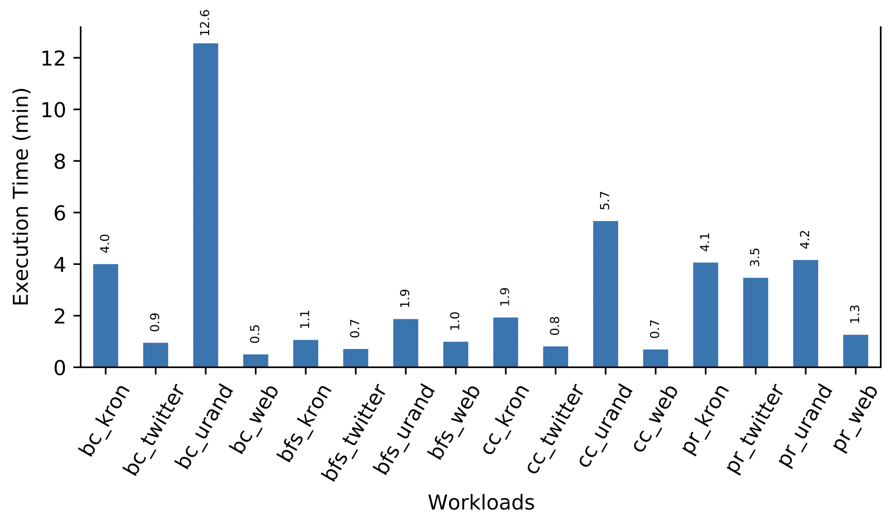
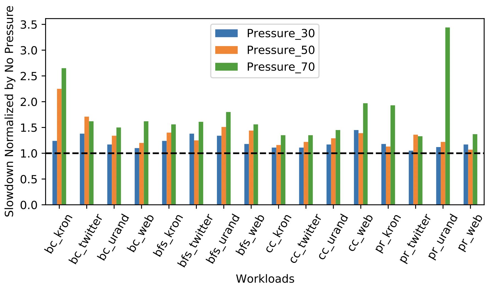

# Get Memory Footprint

* A primeira tarefa é descobrir o memory footprint de cada aplicação. Para isso nós rodamos cada aplicação normalmente. 

<p align="center">
<a href="plots/Max_RSS_per_application.pdf" class="image fit"></a>
</p>

* Analisando o memory footprint ao longo do tempo.

<p align="center">
<a href="plots/RSS_vs_time.pdf" class="image fit"></a>
</p>

* Analisando o tempo de execução

<p align="center">
<a href="plots/exec_time_autonuma_not_pressure.pdf" class="image fit"></a>
</p>

* Depois de executar cada aplicação, nós executamos o seguinte script:

```console
[dmoura@collect_trace]$ ./generate_memory_pressures.sh
```

Esse script irá gerar a quantidade de memória que deve ser disponibilizada a depender da pressão que será dada a aplicação. Nós estamos usando três níveis: 30%, 50% e 70%. Aplicar 30% significa dizer nós configuraremos a memória de modo a não disponibilizar 30% do footprint da aplicação, ou seja, nessa configuração 30% dos dados deverão estar no PMEM. O resultado em algo parecido com oque segue abaixo:

```console
MEM_PRESSURE_30=("4" "3" "8" "6" "5" "5" "9" "6" "5" "5" "9" "7" "5" "5" "9" "6" )
MEM_PRESSURE_50=("8" "7" "11" "9" "9" "8" "11" "10" "9" "9" "11" "10" "8" "8" "11" "10" )
MEM_PRESSURE_70=("12" "11" "13" "12" "12" "12" "14" "13" "12" "12" "14" "13" "12" "12" "14" "13" )

TYPES_OF_MEM_PRESSURE=("30" "50" "70")
```

* Tempo de duração dessa fase 84 minutos.

# Running with Memory Constraint

* Para configurar a dram com diferentes níveis de pressão, nós criamos um programa (lock_memory.c) que recebe como parâmetro a quantidade a ser bloqueada de modo a forçar a aplicação a usar o PMEM.
* Basta executarmos o seguinte comando para iniciar a coleta dos dados com diferentes níveis de pressão de memória:

```console
[dmoura@collect_trace]$ sudo ./start_run.sh
```
Ao final da execução podemos coletar o tempo de execução para cada tipo de pressão de memória:

```console
[dmoura@collect_trace]$ ./get_exec_times.sh
```


Esse script irá gerar um arquivo chamado *exec_times.csv* . Ele serve de entrada para um plot dentro do folder plots.

```console
[dmoura@plots]$ python3 plot_exec_times_slowdown_autonuma.py
```

<p align="center">
<a href="plots/exec_time_autonuma_mem_pressure.pdf" class="image fit"></a>
</p>

* Analisando qual a alocação máxima que ocorreu no PMEM normalizado pela pressão de 30% do memory footprint.

<p align="center">
<a href="plots/max_allocation_in_pmem.pdf" class="image fit"></a>
</p>

<p align="center">
<a href="plots/perc_access_in_pmem.pdf" class="image fit"></a>
</p>


* Tempo de duração dessa fase 205 minutos.

# Post Processing

* Nessa etapa nós iremos processar os dados do perf bem como das alocações interceptadas. Um ponto a destacar nessa fase é a necessidade de alterar o arquivo com as informações de alocação, de modo a quebrar alocações acima de um threshold (hoje configurado em 500MB). Para isso nós criamos um programa (mmap_break_to_chunks.py) que faz o calculo dos intervalos de endereço para cada chunk gerado.

Para executar essa fase, nós executamos o seguinte comando:

```console
[dmoura@collect_trace]$ sudo ./start_post_process.sh
```
* Tempo de duração dessa fase 175 minutos.

# Mapping

* Nessa etapa nós iremos mapear os samples para as alocações. Vale ressaltar que como objetos superiores a 500GB goram divididos em chunks, após o mapemaneto já será possível saber quais chunks tiveram mais acessos.

* Tempo de duração dessa fase 23,4 horas.
